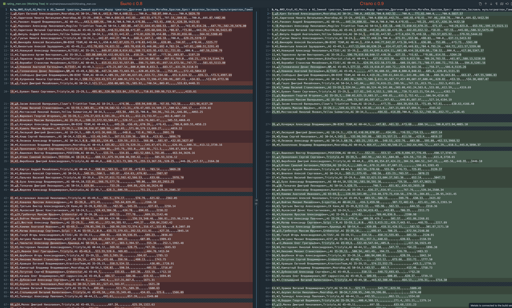

# Сейчас
## Формула
```scala
def calculatePoints(
        athleteResult: FiniteDuration,
        championResult: FiniteDuration,
        competitionPoints: Double
    ): Points = {
      val points = competitionPoints * scala.math.max(
        (1 - (athleteResult - championResult) / 0.8 / championResult),
        0
      )
      val pointsRounded =
        BigDecimal(points).setScale(2, BigDecimal.RoundingMode.HALF_UP).toDouble
      Points(pointsRounded)
    }
```

## Нули
```
# Мужчины
Очков: 0.0, ФИО: Лесюков Александр, Время: 01:29:35, Время победителя: 00:49:10, Место: 28 из 28, Старт: Зимний триатлон
Очков: 0.0, ФИО: Матюш Александр, Время: 01:05:27, Время победителя: 00:32:42, Место: 10 из 10, Старт: Зимний дуатлон
Очков: 0.0, ФИО: Сыроежкин Павел, Время: 00:41:39, Время победителя: 00:22:59, Место: 116 из 116, Старт: Индор триатлон
Очков: 0.0, ФИО: Супранович Александр, Время: 07:47:59, Время победителя: 04:19:38, Место: 230 из 230, Старт: МТ половинка
Очков: 0.0, ФИО: Захарчук Дмитрий, Время: 03:57:07, Время победителя: 02:09:34, Место: 218 из 218, Старт: МТ олимпийка
Очков: 0.0, ФИО: Толкачев Леонид, Время: 02:13:14, Время победителя: 01:12:56, Место: 146 из 149, Старт: МТ спринт
Очков: 0.0, ФИО: Дриганович Александр, Время: 02:16:19, Время победителя: 01:12:56, Место: 147 из 149, Старт: МТ спринт
Очков: 0.0, ФИО: Морозов Иван, Время: 02:16:35, Время победителя: 01:12:56, Место: 148 из 149, Старт: МТ спринт
Очков: 0.0, ФИО: Рутковский Денис, Время: 02:20:19, Время победителя: 01:12:56, Место: 149 из 149, Старт: МТ спринт
Очков: 0.0, ФИО: АНАТОЛИЙ КОМЛЮК, Время: 02:07:24, Время победителя: 01:08:01, Место: 54 из 54, Старт: Раубичи дуатлон

# Женщины
Очков: 0.0, ФИО: Гусева Мария, Время: 02:34:59, Время победителя: 01:24:15, Место: 63 из 63, Старт: МТ спринт
```

# Пробуем 0.9
## Формула
```scala
def calculatePoints(
        athleteResult: FiniteDuration,
        championResult: FiniteDuration,
        competitionPoints: Double
    ): Points = {
      val points = competitionPoints * scala.math.max(
        (1 - (athleteResult - championResult) / 0.9 / championResult),
        0
      )
      val pointsRounded =
        BigDecimal(points).setScale(2, BigDecimal.RoundingMode.HALF_UP).toDouble
      Points(pointsRounded)
    }
```

## Нули
```
# Мужчины
Очков: 0.0, ФИО: Матюш Александр, Время: 01:05:27, Время победителя: 00:32:42, Место: 10 из 10, Старт: Зимний дуатлон
Очков: 0.0, ФИО: Рутковский Денис, Время: 02:20:19, Время победителя: 01:12:56, Место: 149 из 149, Старт: МТ спринт
# Женщины
Никого
```

## Как влияет на рейтинг?

